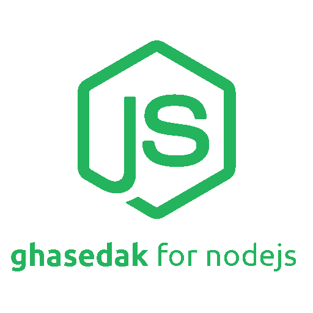

<p align="center">
    
</p>

<p align="center">
  <a href="https://travis-ci.org/ghasedakapi/ghasedak-node">
    
  </a>
  <a href="https://www.npmjs.com/package/ghasedak">
    
  </a>
</p>
<p align="center"><sup><strong> Ghasedak sms webservice package for nodejs. </strong></sup></p>

## install

You can simply install and use ghasedak nodejs library from npm:

```sh
npm install --save ghasedak
```

or from yarn:

```sh
yarn install ghasedak
```

## usage

Import `ghasedak` package:

```javascript
const Ghasedak = require("ghasedak");
```

You need a [Ghasedak](https://ghasedak.me) account. Register and get your API key.

Create an instance from `Ghasedak` class with your API key:

```javascript
let ghasedak = new Ghasedak(
  "3ef8539ba50c06b2a11d674c8a7ded7d7360d7b090b5146ff0761e8d9927bd31"
);
```

Send a single sms:

```javascript
ghasedak.send({
  message: "Hello World!",
  receptor: "09xxxxxxxxx",
  linenumber: "xxxxxxxx",
});
```

Send a group massages:

```javascript
ghasedak.bulk({
  message: "Hello World!",
  receptor: "09xxxxxxxxx",
  linenumber: "xxxxxxxx",
  senddate: "1644732815",
});
```

get the status of massages:

```javascript
ghasedak.status({
  id: "2914845496",
  type: "1",
});
```

Send a verification massages:

```javascript
ghasedak.verification({
  receptor: "09xxxxxxxxx",
  type: "1",
  template: "Your Template",
  param1: "xxx",
});
```

:)

##

## license

Released under the BSD-3-Clause-Clear License.
